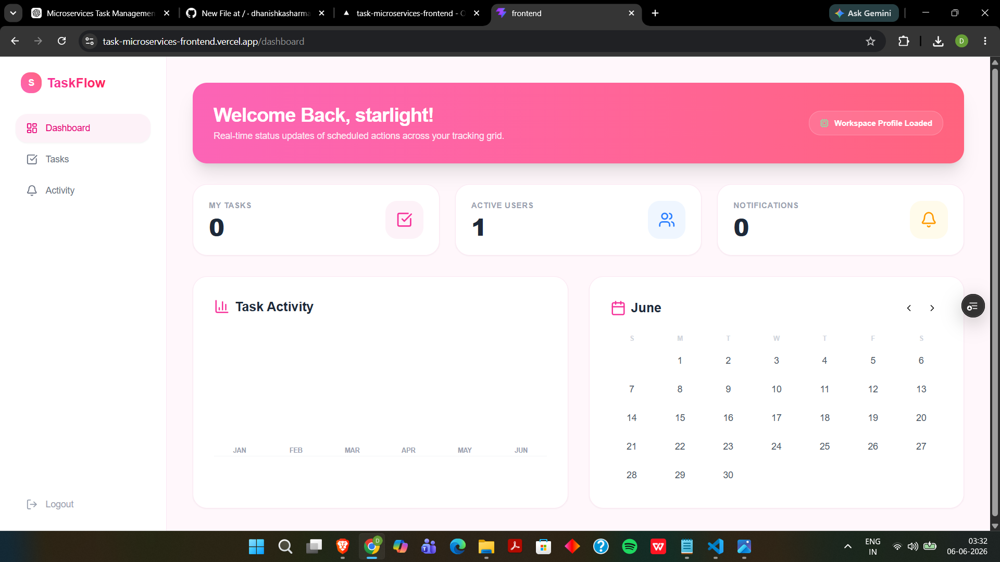
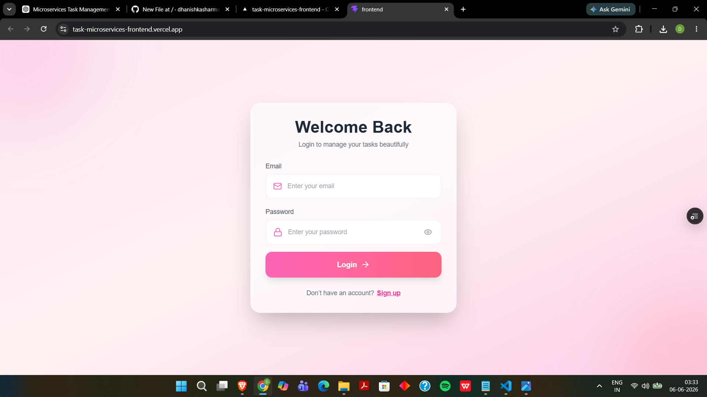
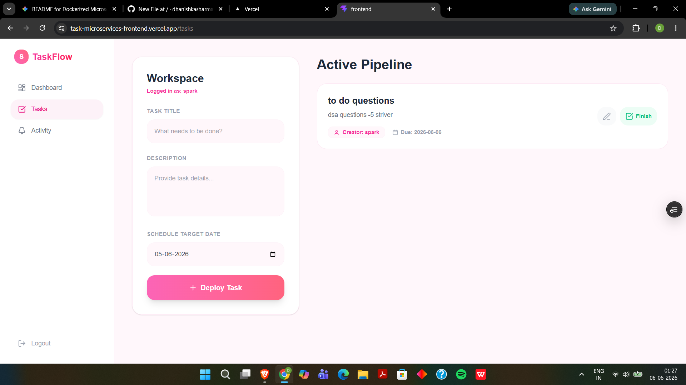
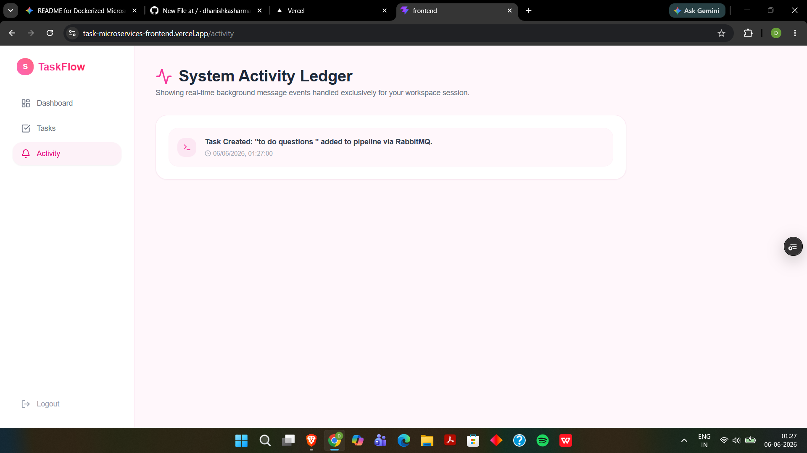
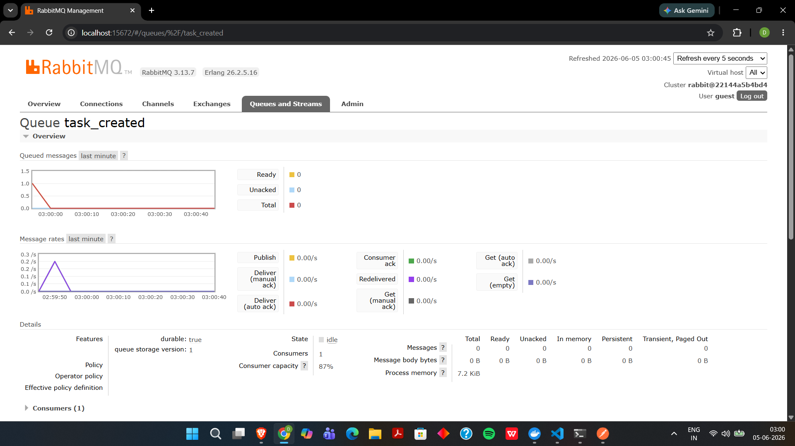

# 🚀 Microservices-Based Task Management System

A scalable and fully containerized **Task Management Platform** built using a **Microservices Architecture** with independent services for authentication, task management, and notifications.

The system uses **RabbitMQ** for asynchronous communication and **Docker Compose** for orchestration of all services and databases.

---

# ✨ Features

* 🔐 JWT Authentication & Authorization
* 📝 Task CRUD Operations
* 🔔 Event-Driven Notification System
* 🐳 Fully Dockerized Architecture
* ⚡ RabbitMQ-based Async Communication
* 📦 Independent Microservices
* 🛠️ Docker Compose Orchestration
* 🚀 CI/CD Ready with GitHub Actions
* 💥 Fault Isolation Between Services

---

# 🏗️ Microservices Architecture

## 🔹 User Service

Handles:

* User Registration
* Login Authentication
* JWT Token Generation
* User Management APIs

---

## 🔹 Task Service

Handles:

* Task Creation
* Task Updates
* Task Deletion
* Task Status Management

Publishes events to RabbitMQ for async notification handling.

---

## 🔹 Notification Service

Handles:

* Event Consumption via RabbitMQ
* Notification Processing
* Queue-based Async Communication
* Fault-Tolerant Notification Flow

---

## 🔹 Frontend

A separate frontend application that integrates all backend services.

Features:

* Login/Register UI
* Dashboard
* Task Management Interface
* Notification Alerts
* Activity Monitoring

---

# 🐳 Dockerized Setup

Each microservice contains:

* Independent Dockerfile
* Separate dependencies
* Isolated runtime environment

The entire stack is managed using:

```bash
docker-compose.yml
```

This enables:

* One-command startup
* Independent deployment
* Easy scalability
* Environment consistency

---

# ⚡ RabbitMQ Event Flow

### Example Flow

1. User creates a task
2. Task Service publishes an event
3. RabbitMQ queues the message
4. Notification Service consumes the event
5. Notification gets processed asynchronously

### Benefits

* Faster API responses
* Loose coupling between services
* Better scalability
* Improved fault tolerance

---

# 📂 Project Structure

```bash
project-root/
│
├── frontend/
│
├── user-service/
│   └── Dockerfile
│
├── task-service/
│   └── Dockerfile
│
├── notification-service/
│   └── Dockerfile
│
├── screenshots/
│   ├── dashboard.png
│   ├── login.png
│   ├── tasks.png
│   ├── activity.png
│   └── rabbitqss.png
│
├── docker-compose.yml
│
└── README.md
```

---

# 📸 Screenshots

## 🔹 Dashboard

<p align="center">
  
</p>

---

## 🔹 Login Page

<p align="center">
  
</p>

---

## 🔹 Task Management

<p align="center">
  
</p>

---

## 🔹 Activity & Alerts

<p align="center">
  
</p>

---

## 🔹 RabbitMQ Notifications & Messaging

<p align="center">
  
</p>

---

# 🚀 Getting Started

## Clone Repository

```bash
git clone <your-repository-url>
cd project-name
```

---

## Run Entire System

```bash
docker-compose up --build
```

---

# 🛠️ Tech Stack

## Backend

* Node.js
* Express.js
* MongoDB
* RabbitMQ

## Frontend

* React.js
* Tailwind CSS

## DevOps

* Docker
* Docker Compose
* GitHub Actions

---

# 📈 Future Improvements

* API Gateway
* Kubernetes Deployment
* Redis Caching
* WebSocket Notifications
* Role-Based Access Control
* Monitoring with Prometheus & Grafana

---

# 👨‍💻 Author

Developed by Dhanishka
Passionate about Full Stack Development, Distributed Systems, and Scalable Backend Architectures.
